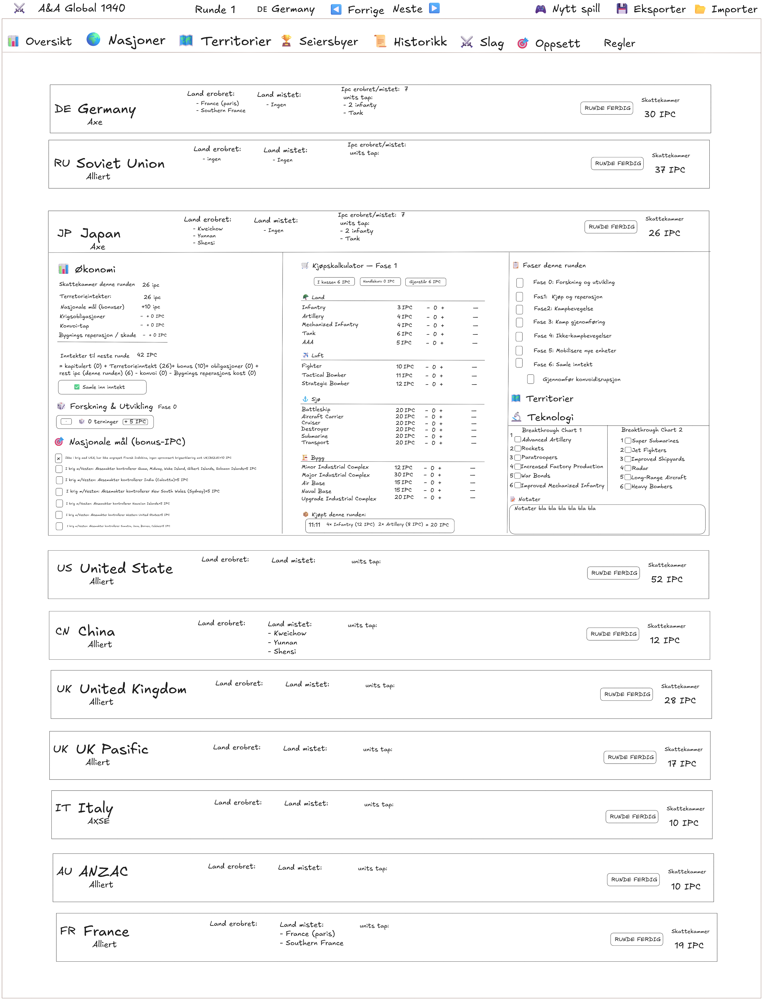
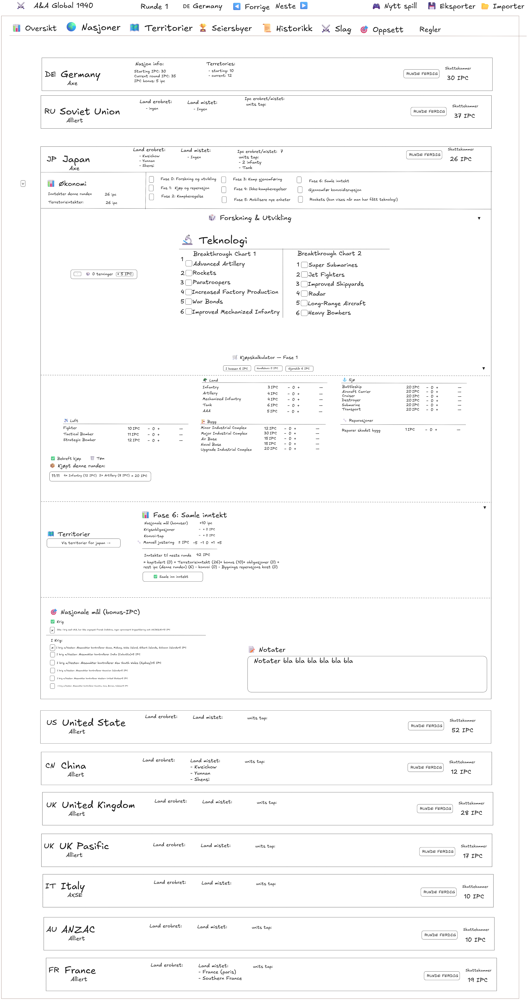

# Axis & Allies Game Tracker

---

## Innholdsfortegnelse
- [Om prosjektet](#om-prosjektet)
- [Funksjoner](#funksjoner)
- [Skjermbilder](#skjermbilder)
- [Bakgrunn](#bakgrunn)
- [Installasjon](#installasjon)
- [Bidra](#bidra)
- [Kontakt](#kontakt)
- [Lisens](#lisens)

---

## Om prosjektet

Dette er et åpent hobbyprosjekt for å utvikle en digital applikasjon som hjelper spillere av Axis & Allies Global 1940 (Second Edition) med å holde oversikt over runder, IPC-inntekter, bonuser og annen spillprogresjon. Prosjektet er tilgjengelig på GitHub for alle som ønsker å bidra eller bruke løsningen.

## Funksjoner
- Holder styr på runder og rekkefølge på spillere
- Registrerer og summerer IPC-inntekter for hver nasjon automatisk
- Håndterer bonuser og nasjonale mål i henhold til reglene
- Gir oversikt over territorier og hvem som kontrollerer dem
- Forenkler oppdatering av spillstatus etter hver runde
- Reduserer risikoen for feil og sparer tid på manuell opptelling

## Skjermbilder
Mockups laget med [Excalidraw](https://excalidraw.com/):

<table>
	<tr>
		<td align="center">
			 
			Mockup nasjoner v1
		</td>
		<td align="center">
			 
			Mockup nasjoner v2
		</td>
	</tr>
</table>

## Bakgrunn

Axis & Allies er en serie strategiske brettspill satt til andre verdenskrig, først utgitt i 1981. Spillet finnes i mange varianter og utgaver, både med globale kart og med fokus på spesifikke slag eller regioner (for eksempel Europa, Stillehavet, D-dagen, Guadalcanal og flere). Felles for alle utgavene er at spillerne tar rollen som de store maktene under krigen, og kjemper om å kontrollere territorier og oppnå seier gjennom taktikk, strategi og samarbeid.

Axis & Allies Global 1940 er en av de mest omfattende og populære utgavene. Den kombinerer to separate spill – Europe 1940 og Pacific 1940 – til én stor global opplevelse. Man må derfor ha begge spillene for å spille Global-varianten. Brettene settes sammen til et gigantisk kart, og alle ni stormakter fra andre verdenskrig er representert: Tyskland, Italia, Japan, Sovjetunionen, Storbritannia, USA, Kina, Frankrike og ANZAC (Australia og New Zealand). Hver nasjon har egne regler, mål og spesialenheter.

Global 1940 byr på et rikt og komplekst spill med mange brikker, markører og detaljerte regler. Spillet har mange faser og mekanikker for inntekt (IPC), bonuser, nasjonale mål, konvoiangrep og politiske situasjoner. Dette gjør det utfordrende å holde oversikt manuelt, spesielt i lange spilløkter eller når flere spillere er involvert. I tillegg er det lett å komme borti markørene på brettet, slik at de faller ut av posisjon eller blir flyttet ved et uhell. Dette fører til at man ofte må telle opp territorier og IPC-verdier på nytt, noe som er tidkrevende og kan føre til feil.

**Merk:** Dette prosjektet og all funksjonalitet tar utgangspunkt i Axis & Allies Global 1940 Second Edition. Det er denne utgaven (kombinasjon av Europe 1940 Second Edition og Pacific 1940 Second Edition) som støttes og beskrives her.

Dette er et hobbyprosjekt jeg jobber med på fritiden, så utviklingen skjer i rykk og napp etter kapasitet og motivasjon.

## Installasjon

_Kommer snart_

## Bidra

Bidrag er velkomne! Åpne gjerne et [issue](https://github.com/tgrendal71/AxiesAndAliesGameTracker/issues) eller lag en pull request.

## Kontakt

[GitHub-profil](https://github.com/tgrendal71)

## Lisens

MIT

**Hva er Vibe Coding?**

Vibe Coding er en moderne tilnærming til programvareutvikling der man kombinerer kreativitet, samarbeid og effektiv bruk av verktøy for å skape gode digitale løsninger. Det handler om å ha en positiv og engasjerende arbeidsflyt, der både utviklere og brukere bidrar til å forme sluttproduktet. Målet er å gjøre utviklingsprosessen inspirerende, inkluderende og resultatorientert.

Prosjektet er åpent for bidrag! Har du forslag til funksjoner, forbedringer eller ønsker å bidra med kode, er du velkommen til å sende inn pull requests eller opprette issues på GitHub.
